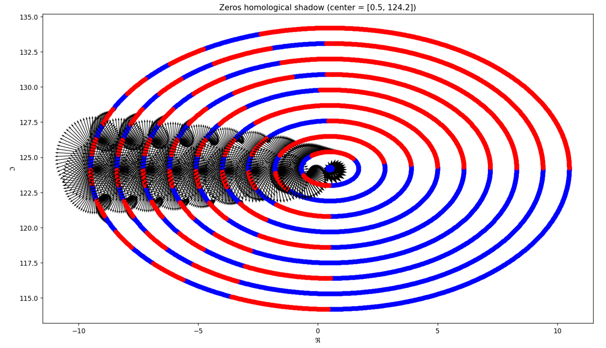

# Homology
### Geometry based optimization algorithm

  

An algorithm of my production, based on homology, that looks for the zeros of the Riemann's Zeta function on the critical line. I would like to apply a similar principle for a new optimization framework for Neural Networks.
