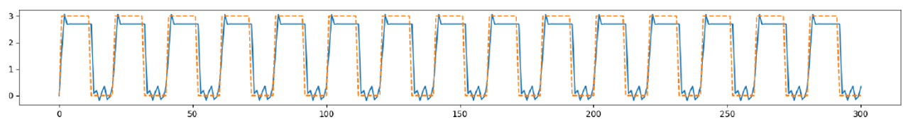
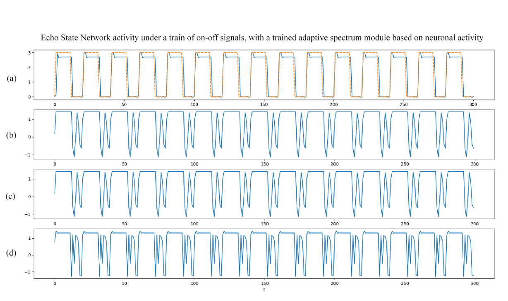

# Neuroscience
### Neural activity based modulation of an Echo State Network

    

Behavior of an Echo State Network activity under a train of on-off signals. This ESN has issues to stay "still" when the output level is set to zero due to the interference of the "echoes".

  

Behavior of an Echo State Network activity under a train of on-off signals. This time the network is equipped with a trained adaptive spectrum module of my production, based on a neuronal activity signal. Thanks to this, the network can rapidly clean its “echoes” when in off-regime. This approach is biologically inspired and could be applied also to mainstream neural networks. (a): ESN output; (b-d): Behavior of some specific ESN neurons.
