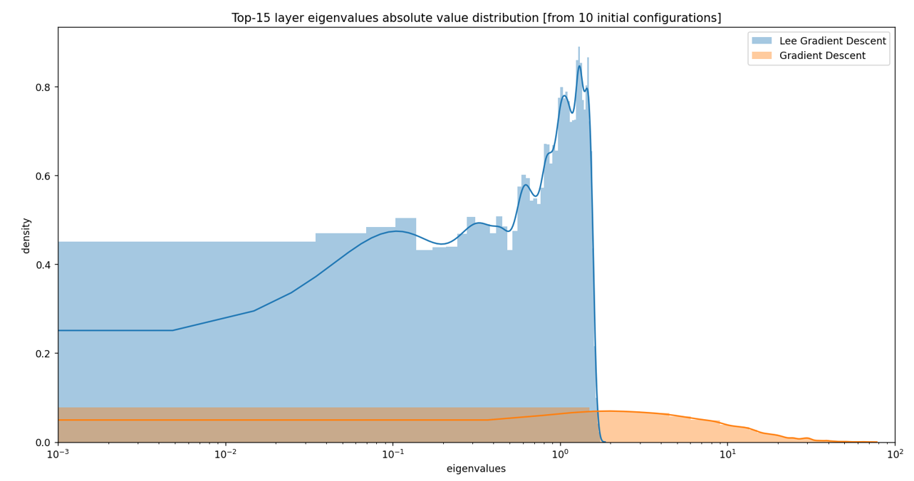
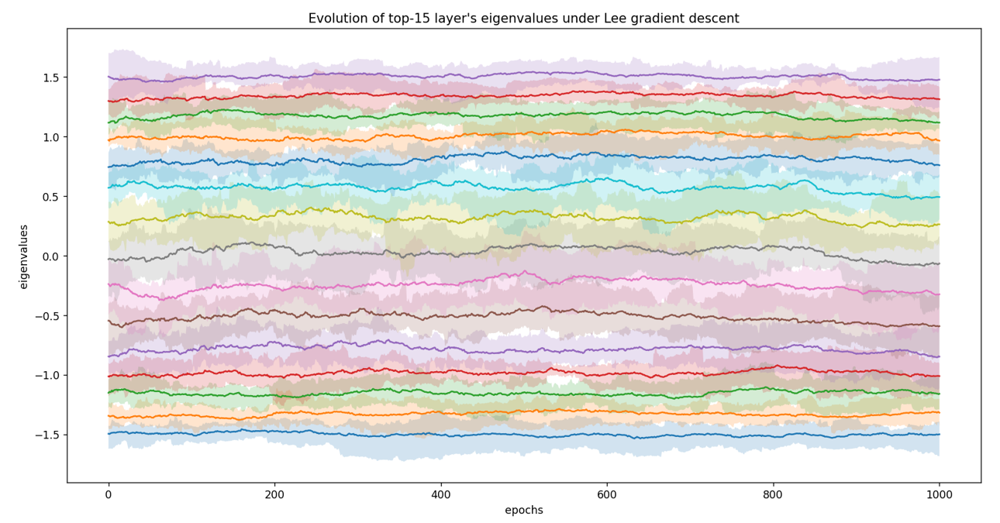

# Optimization
### Lee group based optimization of a Neural Network

  
  
  
  
  

Up: top-15 eigenvalues of a network layer under gradient descent; Down: top-15 eigenvalues of a network layer under a Lee-group based gradient descent scheme I made; centre: distribution of the final eigenvalues. Lee group optimization of Network layers leads to several interesting properties. One example is the nice behavior of the eigenvalues during training, which translates into impactful consequences! 
