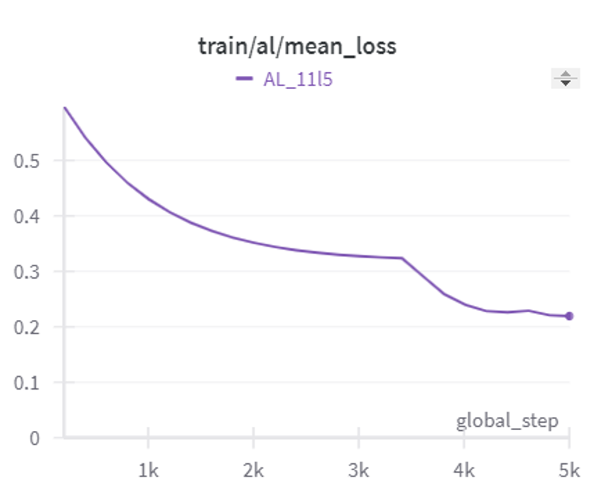

# statistical mechanics

### Generalization "phase-shifts" in Neural Networks

  
  

I cannot go into the details of my work with the IMOS lab, but as a collateral discovery we found that certain gradient-based signals exhibit a phase-shift-like behavior in their magnitude, correlating with the inverse of the loss when abrupt generalization and rapid movement of the network parameters occur. We didn't fully explore this direction yet, but I think it might be interesting to investigate rigorously similar phenomena to enforce faster generalization convergence or to explain the cause behind macro-state weight transitions and different “plasticity” of network weights at different training times.
